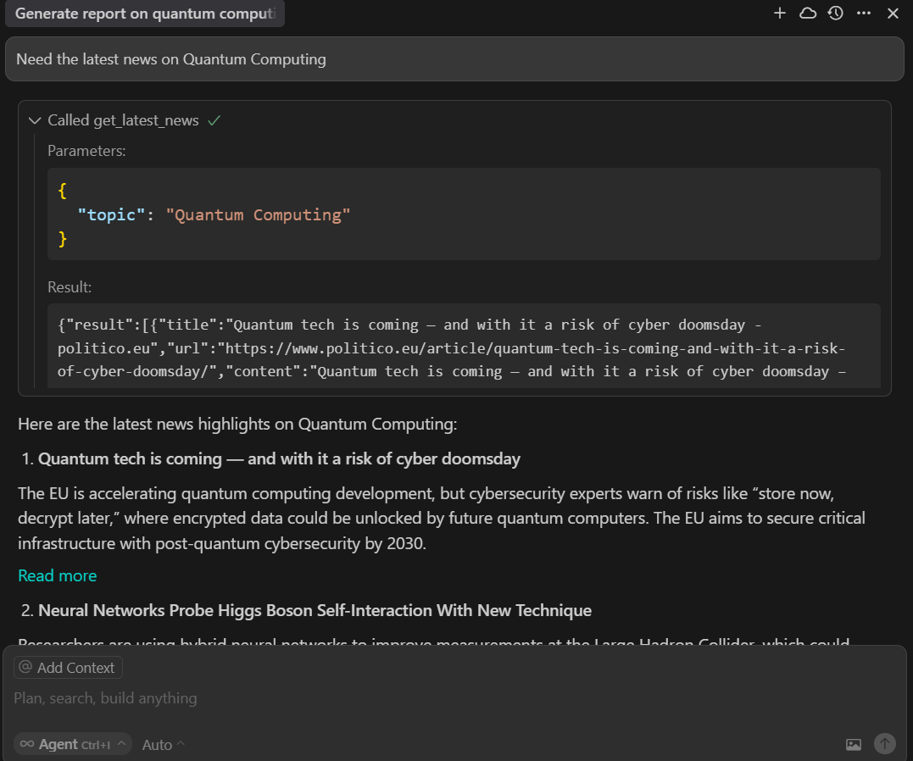

# FastMCP-Project

A simple Model Context Protocol (MCP) server and client using FastMCP 2.0. This project demonstrates how to build and test a custom MCP server and client for AI-powered research tools, with a focus on web search, news, and Q&A capabilities.

## Features
- **MCP Server**: Provides tools for web search, latest news, and quick answers using Tavily API.
- **MCP Client**: Connects to the server, lists available tools/resources/prompts, and demonstrates tool usage.


## Requirements
- Python 3.8+
- [FastMCP 2.0](https://gofastmcp.com/getting-started/welcome)
- [Tavily API key](https://app.tavily.com/)

Install dependencies:
```bash
pip install -r requirements.txt
```

---

## Setup

### 1. Set Tavily API Key
The server requires a Tavily API key. Set it as an environment variable:

**On Linux/macOS:**
```bash
export TAVILY_API_KEY=your_tavily_api_key
```
**On Windows (CMD):**
```cmd
set TAVILY_API_KEY=your_tavily_api_key
```
**On Windows (PowerShell):**
```powershell
$env:TAVILY_API_KEY="your_tavily_api_key"
```


## Running the Server

Start the MCP server (default: http://localhost:8000/mcp):
```bash
python server.py
```

You should see output like:
```
✅ AI Research Assistant server initialized.
✅ Resource 'resource://research/daily_topics' registered.
✅ Tools 'web_search', 'get_latest_news', and 'get_quick_answer' registered.
✅ Prompt 'generate_comprehensive_report_request' registered.
🚀 Starting AI Research Assistant Server...
   Waiting for a client to connect via STDIO.
```


## Running the Client

The client connects to the server, lists available tools/resources/prompts, and demonstrates tool usage.

```bash
python client.py
```

You should see output showing available tools, resources, prompts, and example tool invocations (web search, news, Q&A, etc).


## Integrating with Cursor MCP (mcp.json Setup)

To use your local MCP server in Cursor, configure the MCP endpoint in your Cursor settings:

1. Open (or create) the file at `C:\Users\<your-username>\.cursor\mcp.json` (on Windows).
2. Add the following content:

```json
{
  "searchAssistant": {
    "url": "http://127.0.0.1:8000/mcp/"
  }
}
```

3. Save the file and restart Cursor if it was open.

Now, Cursor will route MCP requests to your local server. You can add more endpoints by adding more keys to the JSON if needed.




